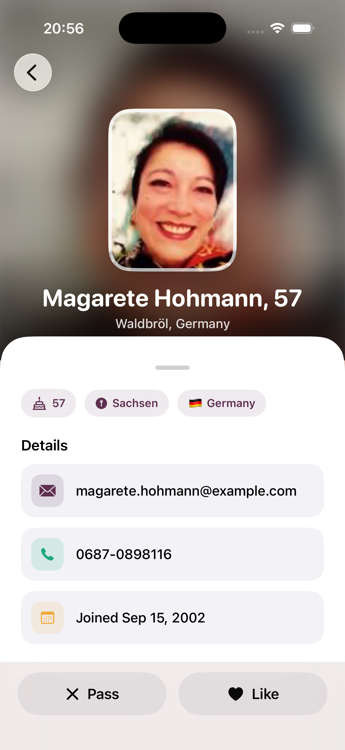
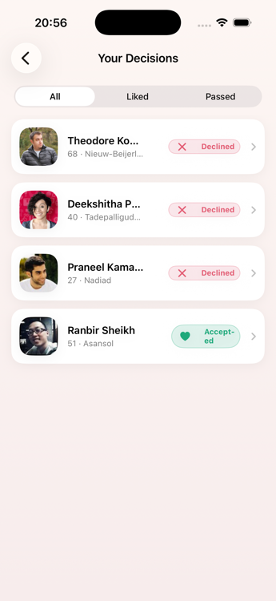

# MatchMate


MatchMate is an iOS matchmaking app built around a Tinder-style swipe deck — browse paginated
profiles from the Random User API, accept or decline with a swipe or a tap, and review every
decision afterward. Every screen stays in sync in real time, and the app keeps working fully
offline once data has been cached. Built with SwiftUI, SwiftData, and a reactive, actor-based
repository as the single source of truth.

## Quick Glance

<table>
  <tr>
    <td align="center"><br/><sub>Discover</sub></td>
    <td align="center"><br/><sub>Profile Detail</sub></td>
    <td align="center"><br/><sub>Your Decisions</sub></td>
  </tr>
</table>

<!-- TODO: add the demo video — drop the file at docs/demo.mp4, or swap the src for a hosted video URL -->
<video src="docs/demo.mp4" controls width="300" poster="docs/screenshots/discover.png">
  Demo video — see docs/demo.mp4
</video>

## Screens

- **Discover** — a Tinder-style swipe deck. Drag right / tap ♥ to like, drag left / tap ✕ to
  pass, undo the last call, tap a card for the full profile. Pagination refills the deck as it
  runs low.
- **Profile detail** — parallax hero, chips, contact details, and a Pass / Like bar that always
  reflects (and can change) the current decision.
- **Your Decisions** — a filterable list (All / Liked / Passed) of everyone decided on. Swipe a
  row to flip the call; tap to open the profile.

## How to run

1. Open `MatchMate.xcodeproj` in Xcode 26 (or newer).
2. Let Swift Package Manager resolve **Kingfisher**.
3. Select an iOS 17+ simulator or device and run (`⌘R`).

No API key or configuration needed — the app calls `randomuser.me` with a fixed seed.

To exercise offline mode: launch once online so a page or two caches, then enable Airplane Mode
and relaunch.

**Tests:** `⌘U`, or

```
xcodebuild test -project MatchMate.xcodeproj -scheme MatchMate \
  -destination 'platform=iOS Simulator,name=iPhone 17'
```

## Architecture

```
SwiftUI Views ─▶ @MainActor @Observable ViewModels ─▶ ProfileRepository (protocol)
                                                              │
                       ┌──────────────────────────────────────┼─────────────────────┐
              actor ProfileRepositoryImpl              @ModelActor ProfileStore   NetworkMonitor
              • canonical in-memory list                • SwiftData persistence   • NWPathMonitor
              • AsyncStream broadcast                   • off the main thread
              • network-first, cache fallback
                          │
              RandomUserRemoteDataSource ─▶ URLSessionHTTPClient (status-code aware)
```

- **Domain** (`Profile`, `MatchStatus`, `ProfileRepository`) — plain `Sendable` value types and one
  protocol. No SwiftUI, SwiftData, or URLSession.
- **Data**
  - `URLSessionHTTPClient` — generic GET, `async/await`, **off the main actor**. Maps HTTP status
    (429 → rate-limited, 5xx → server), transport errors, and decoding errors onto `AppError`.
  - `RandomUserRemoteDataSource` — builds the request from an injected `APIConfig` (base URL, seed,
    page size — nothing hardcoded in the repository).
  - `ProfileStore` — a `@ModelActor`, so every SwiftData read/write runs on its own executor, never
    the main thread. Exposes only domain types; `ProfileEntity` / `ModelContext` never leak out.
  - `ProfileRepositoryImpl` — an `actor` that owns the single source of truth (see below).
- **Presentation** — `DiscoverViewModel` (Discover + Your Decisions share it) and
  `MatchDetailViewModel`, both `@Observable`, depending only on `ProfileRepository`. They hold view
  state and consume streams; no persistence or networking types in sight. The swipe deck
  (`SwipeDeck` / `ProfileDeckCard`), theming (`Palette`), and haptics are pure view concerns.
- **Composition** — `AppEnvironment` builds the graph **once**; Discover and Your Decisions get
  the **same** view-model instance so their streams are already in sync.

There is no use-case layer: for an app this size each use case was a one-line pass-through, so the
view models talk to the repository protocol directly. Pagination / merge / offline orchestration —
the logic actually worth testing — lives in the repository.

## Database choice — SwiftData

`@Model` replaces `.xcdatamodeld` + `NSManagedObject` boilerplate with plain Swift, and it pairs
naturally with `async/await` and Swift concurrency. The whole persistence surface is one
`@ModelActor` (`ProfileStore`) with five methods.

`ProfileEntity` mirrors `Profile` and adds `sortIndex` — a deterministic key
(`(page − 1) × pageSize + indexInPage`) that keeps the list in API order and stable across
re-fetches. `upsert` deliberately **never** overwrites `status`, so a local Accept/Decline always
wins over a re-fetched server row. `MatchMateApp` falls back to an in-memory container if the
persistent store can't be opened, so a corrupt store degrades instead of crashing.

## How pagination + status sync work

### One source of truth, streamed

`ProfileRepositoryImpl` keeps the canonical `[Profile]` in memory and publishes it as a broadcast
`AsyncStream<[Profile]>`. Every screen subscribes to `repository.profiles()` — the Discover deck
takes the pending slice, Your Decisions takes the decided slice, and detail takes
`first { $0.id == id }`.

Because they read the *same* stream they cannot disagree — no shared view model, no `.onAppear`
re-read, no manual refresh, correct even with two screens visible at once. A status change emits
**optimistically** (the in-memory list updates and broadcasts before the DB write); if persistence
fails it reverts and re-emits, and the view model surfaces the error. One code path,
unit-tested — including `undo`, which floats the just-decided profile back to the front of the deck.

### Pagination

- `bootstrap()` loads the cache, emits it immediately (instant first paint), sets the paging
  cursor to `highestCachedPage + 1`, and — if it showed *stale* cache while online — kicks a
  silent background `refresh()`. If the cache is empty it fetches page 1; if that fails offline it
  reports `offlineNoCache` and Discover shows a full-screen retry state.
- As the deck is consumed, `loadMoreIfNeeded()` fetches the next page while the pile is low
  (≤ 4 cards). The network is tried first; the page cursor advances **only on success**, so a
  failed page never wedges pagination.
- Offline, `loadNextPage()` reports `endOfCache` — a toast appears, the deck keeps working
  through what's cached.
- Pull-to-refresh re-fetches every loaded page and merges server-side field changes while keeping
  local `status` and ordering.
- Reconnecting (via `NWPathMonitor`) triggers a `refresh()` automatically.

## Error handling

| Failure | Handling |
|---|---|
| No connectivity | `NWPathMonitor` drives an offline banner; requests fail fast (`waitsForConnectivity = false`) and fall back to cache |
| HTTP 429 | Surfaced as a "slow down" message; cache still shown |
| HTTP 5xx / unexpected status | Surfaced with the code; cache still shown |
| Malformed response | `AppError.decoding`; cache still shown |
| DB read/write failure | `AppError.persistence`; optimistic status change is rolled back |
| Offline cold start, no cache | Full-screen retry state |
| Scrolled past the cache offline | Toast, the deck keeps working through what's cached |

## Concurrency

`SWIFT_DEFAULT_ACTOR_ISOLATION` is set to `nonisolated` for this target: the UI layer
(`@MainActor` view models + views) is the only main-actor code. Networking, JSON decoding, and
SwiftData all run off the main thread — `URLSessionHTTPClient` is a plain `Sendable` struct,
`ProfileStore` is a `@ModelActor`, and `ProfileRepositoryImpl` is an `actor`. Cross-boundary types
(`Profile`, `MatchStatus`, `AppError`, DTOs) are `Sendable` value types.

## Testing

`xcodebuild test` runs ~42 tests across:

- **`DiscoverViewModelTests` / `MatchDetailViewModelTests`** — initial load, deck refills as it
  runs low, ordering, optimistic accept/decline + rollback, `undo` returning a card to the front,
  deck/decided split, offline empty state, end-of-cache, connectivity toggling, and **live
  cross-screen sync** (a status change made outside the view model propagates in).
- **`ProfileRepositoryImplTests`** — the offline-fallback matrix, `sortIndex` assignment, merge
  preserving local status, the paging cursor not advancing on failure, optimistic-then-rollback
  emission order, and multi-subscriber broadcast. Uses a real `RandomUserRemoteDataSource` over a
  stubbed `HTTPClient`.
- **`HTTPClientTests`** — 200 / 429 / 503 / malformed / transport-error mapping via `URLProtocol`.
- **`ProfileStoreTests`** — real SwiftData against an in-memory container: upsert insert/update,
  status preservation, `sortIndex` ordering, `highestLoadedPage`.
- **`ProfileDTOMappingTests`** — `login.uuid → id`, picture URLs, and date parsing (fractional
  seconds, plain ISO-8601, and garbage → `nil` rather than "today").

The mocks (`MockProfileRepository`, `MockProfileStore`, `MockNetworkMonitor`, `MockHTTPClient`)
mirror the real contracts — same ordering, same status-preservation semantics.

## Why Kingfisher

`AsyncImage` only caches in `URLCache`'s session memory, which iOS evicts on termination — every
profile image would re-download on a cold offline relaunch. Offline usability is a core
requirement here, so images need to survive that too. `KFImage` caches to disk automatically.

Random User photos top out at 128 px, so `RemotePhoto` composites a blurred fill behind a crisp,
smaller framed copy rather than stretching one blocky image edge to edge.

## Known gaps

- No SwiftData schema migration — `sortIndex` is a new field and a fresh install is assumed.
- `refresh()` re-fetches all previously-loaded pages sequentially. Fine for the expected data
  volume; not optimized for very deep lists.
- No single-profile deep-linking — the detail screen is always reached from a loaded card/row.

## Manual QA

Detailed walkthroughs and results for the scenarios below are recorded in this
[Google Drive folder](https://drive.google.com/drive/folders/15_QPq3KGBDeCac2FyycEQP_NjssuBXOA?usp=sharing).

| # | Scenario | Result |
|---|---|---|
| 1 | **Pagination** — infinite scroll through the deck | Loads the next page as the pile runs low, no gaps or duplicates |
| 2 | **UI consistency** — feed vs. detail view | Matching data and status between the main feed and the detailed profile view |
| 3 | **Data persistence** — force-quit and relaunch | Profile status survives app termination |
| 4 | **Airplane Mode** — offline browsing | Cached data renders with no network calls |
| 5 | **Cold start offline** — first launch, no connectivity, no cache | Full-screen error state with a **Retry** button |
| 6 | **View model unit tests** | All pass |
